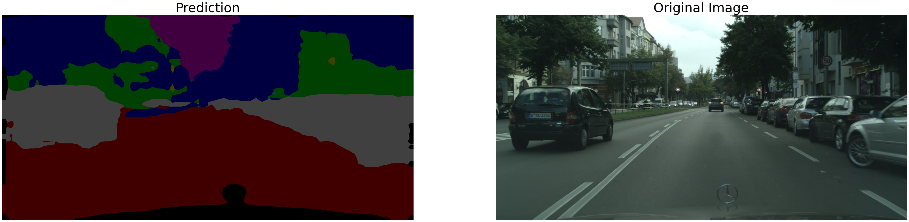

# Projet de Segmentation Sémantique pour Véhicules Autonomes

## Description

Ce projet implémente un modèle de segmentation sémantique d'images pour identifier les composants clés de la route dans le contexte de la conduite autonome. La segmentation sémantique permet de distinguer précisément entre différentes entités telles que les voitures, les piétons, et les panneaux de signalisation, ce qui est crucial pour la sécurité et l'efficacité des véhicules autonomes. 

## Fonctionnalités

- **Détection en temps réel** : Le modèle est optimisé pour une détection rapide des objets parmis 7 catégories principales :
  - Piétons
  - Véhicules
  - Vide
  - Road
  - Nature
  - batiment
  - Signalisation
   
  
- **Visualisation des résultats** : Outils intégrés pour visualiser les sorties du modèle sur les images testées via une application Web App accessible via streamlit.



## Technologies Utilisées

- Python 3.11+
- TensorFlow 2.x
- OpenCV
- NumPy
- HuggingFace transformers

## Installation

Assurez-vous que vous avez Python 3.11 ou plus installé sur votre machine. Vous pouvez installer les dépendances nécessaires avec pip :

```bash
pip install tensorflow opencv-python numpy
```

## Configuration
Pour configurer le projet, suivez les étapes ci-dessous :

**Clonez le dépôt du projet :**
```bash
git clone https://github.com/votreUsername/votreProjet.git
```

**Installez les dépendances :**
```bash
pip install -r requirements.txt
```

## Auteurs
@Clemagda

## Remerciements
Projet inspiré du dataset [Cityscape](https://www.cityscapes-dataset.com/)
